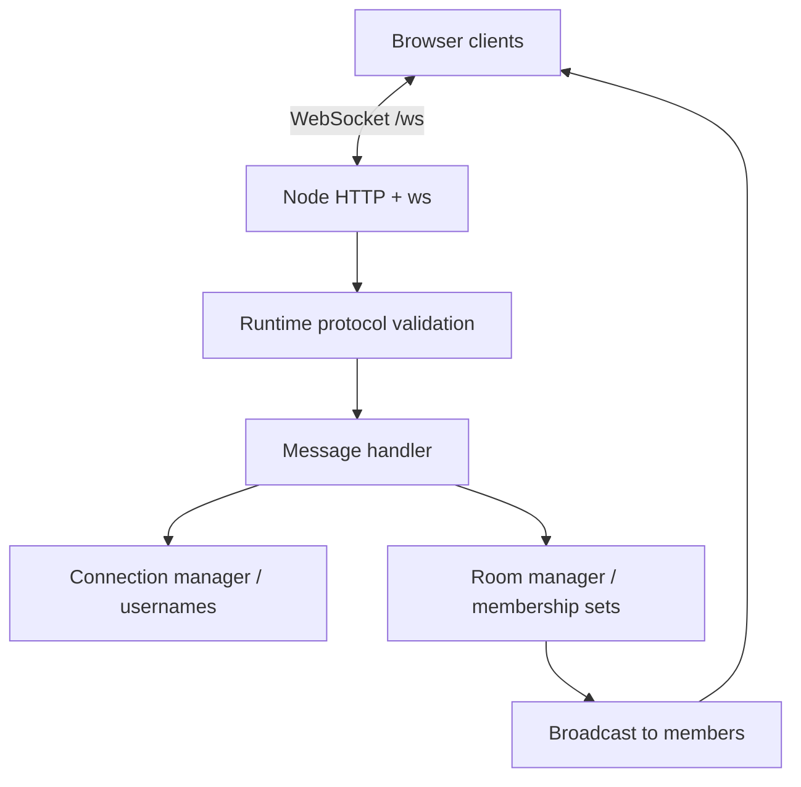

# Realtime Chat

A small Node.js + TypeScript chat built with `ws` to understand persistent, bidirectional communication. **Milestone 4:** room chat, presence, typing indicators, and a responsive browser demo.

## Why I Built This

The goal is to understand realtime backend engineering and explain every important decision, while keeping the complete codebase small enough to study.

## Features

- Multiple simultaneous WebSocket connections.
- Validated, case-insensitive unique usernames for each live session.
- Join and leave `general`, `developers`, and `random`; join multiple rooms.
- Broadcast only to room members, including the sender.
- Room presence: snapshots on join plus live joined/left updates for room members.
- Server-generated sender identity, message IDs, and timestamps.
- Disconnect cleanup, payload limits, structured logs, and typed errors.
- Minimal browser interface with manual disconnect/connect.

Typing indicators are scoped to room peers, throttled by the client, and expired by the server. Heartbeat and automatic reconnection are future milestones.

## Running Locally

Use Node.js 24 and npm. From this directory:

```sh
npm ci
npm run dev
```

Open **http://127.0.0.1:3000**. Set `PORT` to change the port. The WebSocket endpoint is `/ws`; the server binds to loopback for local development.

For compiled execution:

```sh
npm run build
npm start
```

Keep `public/` alongside `dist/` when running the compiled server. Node 24 runs development TypeScript by stripping supported type syntax; this does not type-check it. The build emits JavaScript and rewrites relative `.ts` imports to `.js`.

## Two-Window Demo

1. Open the app in two browser windows.
2. Connect as `Nathan` in one and `Grace` in the other.
3. Select `developers` and click **Join** in both.
4. Send a message and see the same server event appear in both windows.
5. See the online member list change as the other user joins, leaves, or disconnects.
6. Leave in one window; new messages no longer arrive there.
7. Disconnect and connect again; choose a room and rejoin explicitly.

The browser keeps at most 200 received messages per room in memory. There is no server history, offline delivery, persistence, or automatic retry. Switching the selected room does not leave other joined rooms.

## Architecture



`server.ts` owns process startup; `app.ts` wires transport, static assets, and cleanup. Focused managers own identity and room membership. The handler authorizes and dispatches events. The browser uses its native WebSocket API; Express and frontend frameworks are unnecessary here.

## WebSocket Flow

The browser requests HTTP Upgrade, `ws` accepts, and the connection stays open. The server sends `welcome` with a connection ID and available rooms. The client sets its username and joins a room. On chat events, the server validates the payload, verifies identity and membership, creates the outgoing event, and sends it to every current room member.

## Message Protocol

Client events:

```json
{ "type": "set_username", "payload": { "username": "Nathan" } }
{ "type": "join_room", "payload": { "roomId": "developers" } }
{ "type": "chat_message", "payload": { "roomId": "developers", "message": "Hello!" } }
{ "type": "leave_room", "payload": { "roomId": "developers" } }
```

Each line above is a separate WebSocket message. The server acknowledges identity with `identified` and membership operations with `room_joined` / `room_left`. Joining also receives a `presence_snapshot`; remaining members receive `user_joined`. Leaving or disconnecting sends `user_left` to remaining room members. Chat broadcasts contain `id`, `roomId`, `user: { connectionId, username }`, `message`, and `timestamp`. An `echo` event remains available for diagnostics; it is not a heartbeat.

Usernames allow 3–20 ASCII letters, digits, or underscores. They are fixed until disconnect and compared case-insensitively. Chat text must be nonblank and at most 1,000 JavaScript string code units. Extra fields are ignored; sender identity comes from the server's connection record.

Malformed JSON, binary application messages, and invalid shapes produce `INVALID_MESSAGE`. Other error codes are `USERNAME_TAKEN`, `ALREADY_IDENTIFIED`, `USERNAME_REQUIRED`, `INVALID_ROOM`, and `NOT_IN_ROOM`. Errors use `{ type: 'error', payload: { code, message } }`. Incoming messages over 4,096 bytes close with code 1009.

## Tech Stack and Tests

Node.js 24, TypeScript, `ws`, Vitest, ESLint, TypeScript ESLint, and Prettier. Exact versions and a committed lockfile provide repeatable installation.

```sh
npm run typecheck
npm run lint
npm test
npm run build
npm run format:check
```

Tests use real local TCP/WebSocket clients and ephemeral ports. They cover transport behavior, validation, room isolation, duplicate joins, identity spoof attempts, username conflicts, multi-room membership, and normal/abnormal disconnect cleanup. See [verification](docs/verification.md) for the latest executed checks.

## Key Engineering Decisions

- `Map<connectionId, Connection>` locates sessions; a normalized username map enforces uniqueness.
- `Map<RoomId, Set<connectionId>>` prevents duplicate membership and supplies each room's live presence. Disconnect scans three fixed rooms; a reverse index would add consistency work without useful benefit at this scale.
- TypeScript discriminated unions describe events; runtime guards validate untrusted JSON.
- Successful join/leave acknowledgements are idempotent. Chat broadcasts include the sender so all clients render the same authoritative event.
- Client text uses `textContent`, not HTML interpolation. Static assets come from an explicit allowlist.
- Incoming size and outgoing buffered-byte limits bound individual payloads and slow-client queues. These do not replace rate limits.
- Shutdown requests code 1001 closes, then terminates remaining peers after one second. This is not a heartbeat.
- TypeScript 6.0.3 is a compatibility exception: TypeScript ESLint 8.70.0 excludes TypeScript 7 from its declared peer range.

## What I Learned

[Milestone 1](docs/milestone-1.md) explains Upgrade, frames, persistent connections, the event loop, and lifecycle. [Milestone 2](docs/milestone-2.md) explains identity, Map/Set choices, authorization, broadcasting, cleanup, and test ordering. The [development plan](docs/plan.md) records the remaining milestones.

## Future Improvements

Ping/pong heartbeat, capped reconnection backoff with jitter, Docker, GitHub Actions, and final license selection. Origin policy and event rate limits need attention before public hosting. Anonymous usernames are not authenticated identity, and all state belongs to one process.

See [Milestone 4](docs/milestone-4.md) for the typing protocol, timing choices, and frontend changes.

The repository is [ts-websocket-chat](https://github.com/k11ngp1ng/ts-websocket-chat). Docker and hosted CI are not implemented or claimed yet.
