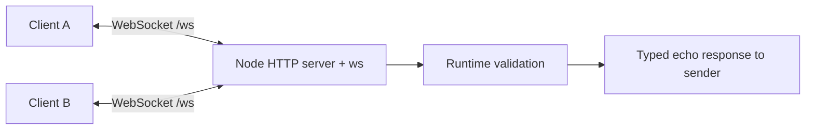

# Realtime Chat

A learning-first Node.js + TypeScript WebSocket project. **Milestone 1 only:** persistent connections, typed welcome/echo events, validation, and integration tests. Chat rooms and the browser interface come next.

## Why I Built This

The goal is to understand persistent bidirectional communication and explain the backend decisions, while keeping the complete codebase small enough to study.

## Running Locally

Use Node.js 24 and npm. From this directory:

```sh
npm ci
npm run dev
```

The server listens at `ws://127.0.0.1:3000/ws`. Set `PORT` to change the port. It binds to loopback for this local milestone. An ordinary browser navigation returns HTTP 404; there is no frontend yet.

For compiled execution:

```sh
npm run build
npm start
```

Node 24 runs the development TypeScript directly by stripping supported type syntax. This does **not** type-check it; `npm run typecheck` is mandatory. The build emits JavaScript and rewrites relative `.ts` imports to `.js`.

## Try a Persistent Connection

In another terminal run `node`, then paste:

```js
const socket = new WebSocket('ws://127.0.0.1:3000/ws');
socket.onmessage = (event) => console.log(JSON.parse(event.data));
socket.onopen = () =>
  socket.send(
    JSON.stringify({
      type: 'echo',
      payload: { message: 'Hello!' },
    }),
  );
```

After it connects, send another event through the **same** object:

```js
socket.send(
  JSON.stringify({ type: 'echo', payload: { message: 'Still here' } }),
);
socket.close(1000, 'Done');
```

Use two terminals to demonstrate simultaneous clients. Echo replies return only to their sender; broadcasting is a later milestone.

## Architecture



`src/server.ts` starts the process and handles signals. `src/app.ts` owns transport setup and lifecycle. `src/types/protocol.ts` defines wire types and validates untrusted data. A factory lets each integration test use an ephemeral port without starting the CLI entry point.

## Message Protocol

Server immediately sends:

```json
{ "type": "welcome", "payload": { "connectionId": "server-generated UUID" } }
```

Client sends, and server echoes:

```json
{ "type": "echo", "payload": { "message": "Hello!" } }
```

Only text JSON is accepted. The message must contain a nonblank string of at most 1,000 JavaScript string code units. Extra fields are ignored and never echoed. Invalid JSON, shapes, or types produce an `error` event with code `INVALID_MESSAGE`; the connection stays usable. Messages over 4,096 bytes are closed by `ws` with code 1009. Binary application messages are rejected.

## Checks

```sh
npm run typecheck
npm run lint
npm test
npm run build
npm run format:check
```

Tests connect real `ws` clients over local TCP, checking concurrent connections, repeated exchanges, bad JSON and payloads, binary input, oversized messages, disconnect cleanup, wrong paths, and HTTP behavior. They register listeners before sending and use ephemeral ports instead of timing sleeps.

## Key Engineering Decisions

- `ws` is the only runtime dependency. Node's HTTP server is enough for Upgrade handling; Express would add little here.
- Strict TypeScript plus runtime guards: TypeScript cannot validate network input after compilation.
- No connection manager yet: the built-in `wss.clients` set tracks sockets for this milestone. Dedicated user and room maps become useful once identity and membership exist.
- Structured lifecycle logs omit message bodies. Compression is disabled to keep resource use and protocol behavior simple.
- Shutdown requests code 1001 closes, then terminates remaining peers after one second. This shutdown deadline is not a heartbeat.
- Exact dependencies and a lockfile make installation repeatable. TypeScript 6 is an intentional compatibility exception: TypeScript ESLint 8.70.0 rejects TypeScript 7 in its peer range. Revisit together when supported.

## What This Milestone Teaches

HTTP Upgrade, persistent sockets, server push, asynchronous event handlers, runtime validation, connection state, and integration testing. See [the connection walkthrough](docs/milestone-1.md) and [the development plan](docs/plan.md).

## Future Milestones

Usernames, rooms, broadcasting, presence, a minimal browser demo, typing, heartbeat, reconnect/backoff, Docker, and GitHub Actions. These are planned, not implemented. No authentication, storage, or multi-process scaling is included. Origin restrictions, rate limits, and outbound backpressure need attention before public hosting; this milestone is a local demonstration.

Docker instructions, final portfolio claims, and a license will be added in later milestones. The repository is [ts-websocket-chat](https://github.com/k11ngp1ng/ts-websocket-chat). No hosted CI run is claimed yet.
