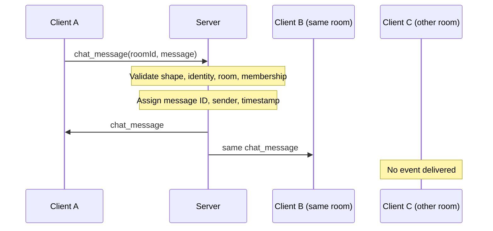

# Milestone 2: identity, rooms, and broadcasting

## What changed and why

The transport demo now supports actual chat. `set_username` associates a validated display name with a live connection. `join_room` and `leave_room` change membership. `chat_message` is broadcast only after the server verifies that the sender belongs to the target room. A small browser page makes this visible in two windows.

The server remains one process with no database, authentication system, or framework. Presence and typing events are not part of this milestone. The browser's connected status describes its own session, not a room's online-user list.

## Identity: two Maps

`ConnectionManager` stores `Map<connectionId, Connection>` for direct socket/identity lookup. Another map uses lowercase usernames as keys. This prevents `Nathan` and `nATHAN` from being claimed at the same time without scanning every session.

Names use 3–20 ASCII letters, numbers, or underscores. This deliberately simple policy avoids introducing Unicode normalization and confusable-name policy into a small demo. Validation happens before the manager sees the event.

A name cannot change within a connection. Repeating the same name returns the acknowledgement again. Another name returns `ALREADY_IDENTIFIED`. A conflicting claim returns `USERNAME_TAKEN`, and that connection can try a different name. Browser users reconnect after a rejection to choose again.

The server derives chat authors from this record. A client cannot impersonate another sender by adding a `user` field to its payload. These are anonymous display names, however: reconnecting later can claim a name once its previous session ends. Authentication would be a different project concern.

## Membership: a Map of Sets

`RoomManager` stores `Map<RoomId, Set<connectionId>>` for three fixed rooms. A set guarantees that joining twice does not deliver a broadcast twice. Joining and leaving are idempotent: repeating the action is safe and returns an acknowledgement of the resulting state.

A connection can join multiple rooms. The browser's selected room chooses which local messages to display and where to send; it does not implicitly leave other rooms.

An alternative is two indexes: room-to-connections and connection-to-rooms. That makes cleanup proportional to rooms actually joined, but every membership operation must update both indexes consistently. Scanning only three room sets on disconnect is simpler here. Add a reverse index if dynamic rooms make that scan expensive.

## Message lifecycle

Broadcast includes the sender. The browser waits for that server event rather than rendering an optimistic duplicate. This keeps all members on the same event representation, without adding delivery acknowledgements or retry deduplication. A server write does not prove another browser read or displayed the message.

Handlers run synchronously between asynchronous I/O callbacks. A membership change and a broadcast cannot interleave halfway through their JavaScript operations in this process. Network arrival order across different clients still varies; there is no cross-client ordering guarantee. A room leave takes effect when the server processes it and sends its acknowledgement; already delivered messages are not erased.

## Cleanup and simple bounds

Normal close and transport failure converge on the socket's `close` callback. It removes the ID from every room, releases the username, and removes the connection record. Cleanup is safe to repeat. A fresh connection must identify and join again.

The existing 4 KiB incoming limit and 1,000-code-unit message limit remain. The send helper terminates a peer when its queued outgoing bytes already exceed 64 KiB, instead of allowing continued queue growth. This is a simple per-peer safeguard, not a throughput or rate-limit guarantee. Heartbeat remains necessary for half-open connections and will be added separately.

The browser caps received history at 200 messages per room, renders message bodies using `textContent`, and disables sending until a join acknowledgement arrives. The server still independently enforces all membership rules. HTTP serves only three allowlisted assets; source files and package metadata are not served.

## How this was tested

Integration tests use real sockets. A three-client scenario proves that the same event reaches both members exactly once, while a client in a different room receives none. Tests also try forged author fields, unavailable rooms, sends before joining, duplicate usernames, malformed payloads, multiple memberships, repeated leaves, and normal/abnormal disconnects.

To check that an event did not arrive, tests request an echo on the observing connection after the sender's event has been processed. WebSocket ordering guarantees that earlier broadcasts on that observing socket would precede its echo response. This avoids arbitrary sleep windows in negative-delivery assertions.

The browser demo was exercised with two independent tabs: connect, join developers, exchange messages, render HTML-looking text safely, leave, verify no further delivery, disconnect, and connect manually again.

Suggested commit: `feat: add usernames, room chat, and browser demo`.

Next milestone: room presence snapshots plus joined/left notifications, using the identity and membership structures already introduced here.
