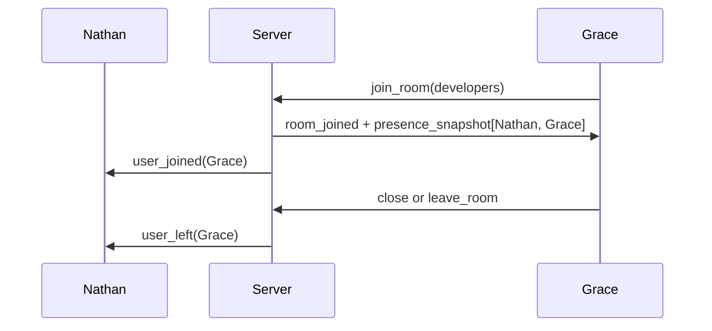

# Milestone 3: room presence

## What presence means here

Presence is an in-memory view of named connections currently joined to a room. It is not account status, a durable last-seen value, or a guarantee that a remote person is actively reading. A user is shown as online only while their live WebSocket session belongs to that room.

## Events and ordering

When a named client joins a room, the server adds it to the room set, sends that client `room_joined`, then sends a `presence_snapshot` containing all current room users. The snapshot is server-generated and sorted by username to keep it stable for clients and tests.

The server then sends `user_joined` to the existing room members, excluding the joiner. On a real leave or socket close, it removes membership first and sends `user_left` only to the remaining members. Repeated joins or leaves are safe: they keep acknowledgement behavior but do not emit duplicate presence changes.

Each socket preserves the order in which the server sends its own messages. There is no global ordering promise across separate clients. The browser holds a small presence list per joined room, replaces it on a snapshot, then applies joined/left deltas by connection ID.

## Why use the existing structures

`RoomManager` already holds `Map<RoomId, Set<connectionId>>`; that set is the source of truth for who is present. `ConnectionManager` resolves each ID to its server-validated username. Reusing those indexes avoids a separate presence store that could fall out of sync with membership.

On disconnect, the room manager returns the rooms it actually removed the connection from. This lets the transport layer issue the same `user_left` events as an explicit leave before releasing the username and connection record. The ordering matters: recipients need the connection record available while the departure event is built.

## Tests and boundaries

Integration tests verify snapshot content, room-scoped joins and departures, no update for an unrelated room, repeated operations, and cleanup after a transport drop. Test clients use an event queue because a WebSocket can deliver the join acknowledgement and snapshot before a test awaits the second one; real browser clients attach one permanent message handler for the same reason.

Presence needs a later heartbeat milestone. Without ping/pong, a half-open connection may stay marked online until the transport closes. This implementation also applies only inside one Node process. Multi-instance presence needs shared coordination, which is deliberately outside this project’s current scope.

Suggested commit: `feat: add room presence tracking`.
