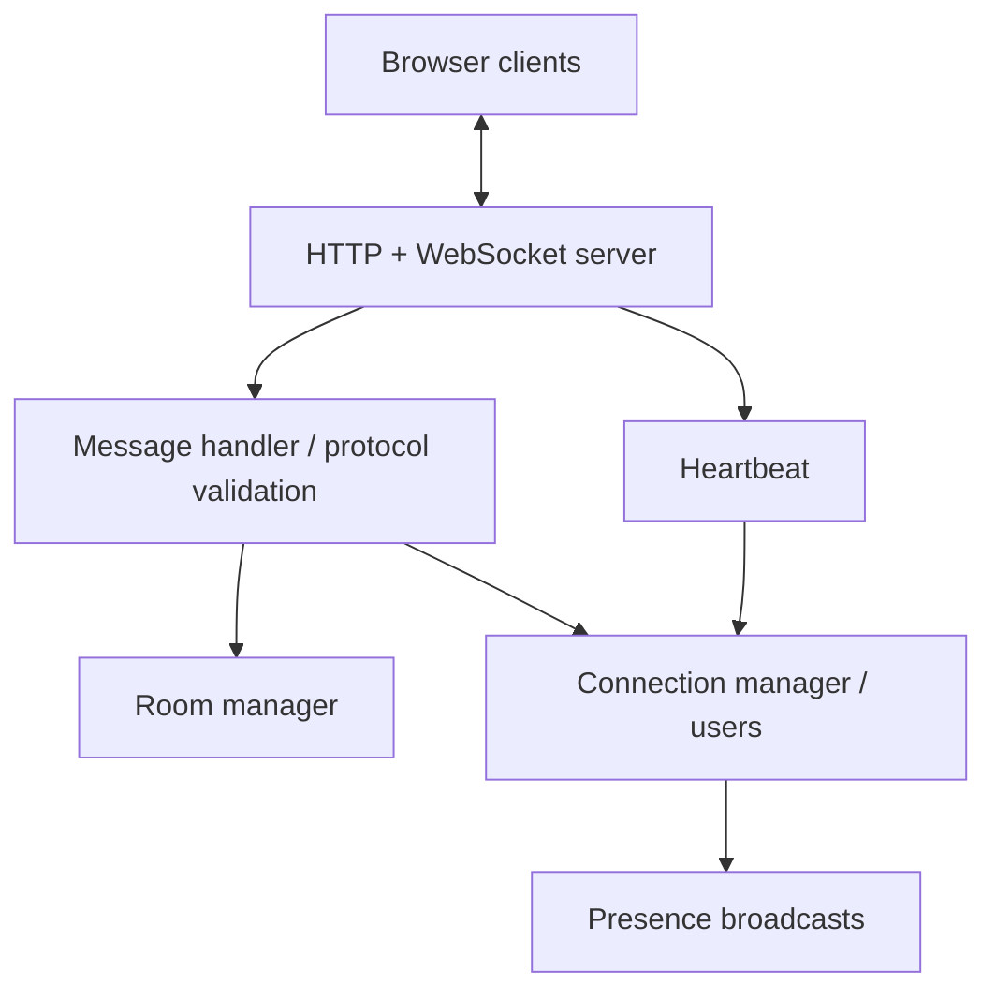

# Incremental development plan

## Current progress

Milestones 1 and 2 are implemented: transport, identity, rooms, broadcasting, and a browser demo. Presence is next. See [Milestone 2 learning notes](milestone-2.md).

## Environment inspected

The supplied workspace had no project files and was not a Git repository. Node 24.19.0 and Git were available; npm was not on PATH. A workspace-local npm was downloaded for dependency installation. On an ordinary Node 24 installation, use the standard npm commands in the README.

## Proposed final architecture

One Node process owns HTTP Upgrade, WebSocket transport, connection identities, in-memory room membership, presence events, and heartbeat. A message handler validates and dispatches typed events. The browser uses its native WebSocket API. No database, broker, Express, or frontend framework is planned.



```text
realtime-chat/
  src/
    server.ts
    app.ts
    websocket/
      connection-manager.ts
      room-manager.ts
      message-handler.ts
      heartbeat.ts
    types/protocol.ts
    utils/logger.ts
  public/{index.html,app.js,styles.css}
  tests/
  docs/
  .github/workflows/ci.yml
  Dockerfile
  .dockerignore
  .gitignore
  package.json
  package-lock.json
  tsconfig.json
  tsconfig.build.json
  eslint.config.js
  README.md
  LICENSE
```

Only create modules as their responsibilities appear. Presence initially belongs to connection/room events; a separate presence service is unnecessary.

## Dependencies

| Dependency        | Purpose                                                                        |
| ----------------- | ------------------------------------------------------------------------------ |
| ws                | WebSocket server and Node integration-test clients; sole production dependency |
| typescript        | Strict checking and JavaScript compilation                                     |
| @types/node       | Node 24 API declarations, matching the runtime major                           |
| @types/ws         | ws API declarations                                                            |
| vitest            | Test runner and assertions for real socket behavior                            |
| eslint            | Static lint checks                                                             |
| typescript-eslint | TypeScript parser and recommended lint rules                                   |
| prettier          | Consistent formatting independent of lint rules                                |

Install stable compatible releases, pin exact versions, and commit the lockfile. Node 24's native type stripping/watch mode avoids a development runner. No browser dependencies are needed.

## Milestones and expected commits

| Milestone | Deliverable and validation                                                                                                                   | Suggested commits                                                                                                                                                                |
| --------- | -------------------------------------------------------------------------------------------------------------------------------------------- | -------------------------------------------------------------------------------------------------------------------------------------------------------------------------------- |
| 1         | Small server, welcome/echo protocol, real-client tests, strict checks, lint, compiled smoke run                                              | `chore: initialize TypeScript project`; `feat: create WebSocket server`; `test: verify WebSocket connection lifecycle`; `docs: explain WebSocket handshake and development plan` |
| 2         | Username validation; join/leave fixed rooms; broadcast only to members; reject nonmember sends; simple browser demo                          | `feat: define typed chat protocol`; `feat: add connection management`; `feat: implement chat rooms`; `feat: add message broadcasting`; `feat: add minimal browser chat demo`     |
| 3         | Presence snapshots and joined/left events; clean disconnect membership                                                                       | `feat: add presence tracking`                                                                                                                                                    |
| 4         | Throttled typing transitions and expiry; clear on leave/disconnect                                                                           | `feat: implement typing indicators`                                                                                                                                              |
| 5         | Protocol ping/pong; terminate silent peers; test cleanup deterministically                                                                   | `feat: add heartbeat mechanism`                                                                                                                                                  |
| 6         | Capped exponential backoff with jitter; intentional disconnect suppresses retries; restore desired room after reconnect                      | `feat: implement client reconnection`                                                                                                                                            |
| 7         | Test cross-room isolation and lifecycle edge cases; review limits/origins/backpressure; Docker build; CI; final README and demo instructions | `test: expand WebSocket integration coverage`; `chore: add Docker support`; `ci: add GitHub Actions workflow`; `docs: document realtime chat architecture and demo`              |

For every milestone: run the application, relevant tests, typecheck, lint and build; fix failures, explain what changed and learned, and suggest its commit. Do not fabricate a history by committing an entire finished application as an initial commit. The first commit captures the tested Milestone 1 as `feat: create TypeScript WebSocket server`. It includes tooling, the small server, tests, and learning notes so the initial checkout is runnable. Future milestones remain separate commits.

## Risks and scope boundaries

- Room membership must be checked on every send; never trust the client-supplied room or username.
- Decide duplicate username handling before identity implementation. Anonymous names are not authenticated identity.
- Incoming size limits, event rate limits, and outgoing buffered-byte limits solve different problems.
- Origin checks help browser deployment policy but do not authenticate nonbrowser clients.
- Disconnect cleanup must be idempotent, including heartbeat termination and shutdown.
- Typing needs expiry to avoid stale indicators and throttling to avoid one event per keypress.
- Reconnect creates a fresh session; reliable delivery/history would require additional protocol and storage design.
- In-memory rooms support one process only. Redis, multiple instances, durable history, JWT, file uploads, read receipts, Kubernetes, and frontend frameworks are outside this portfolio project's scope.
- Docker and GitHub Actions are later deliverables. A valid workflow file is not evidence of a successful hosted run.
